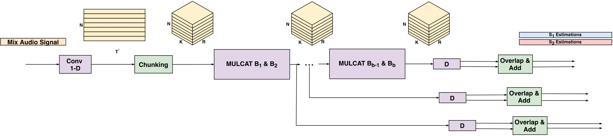
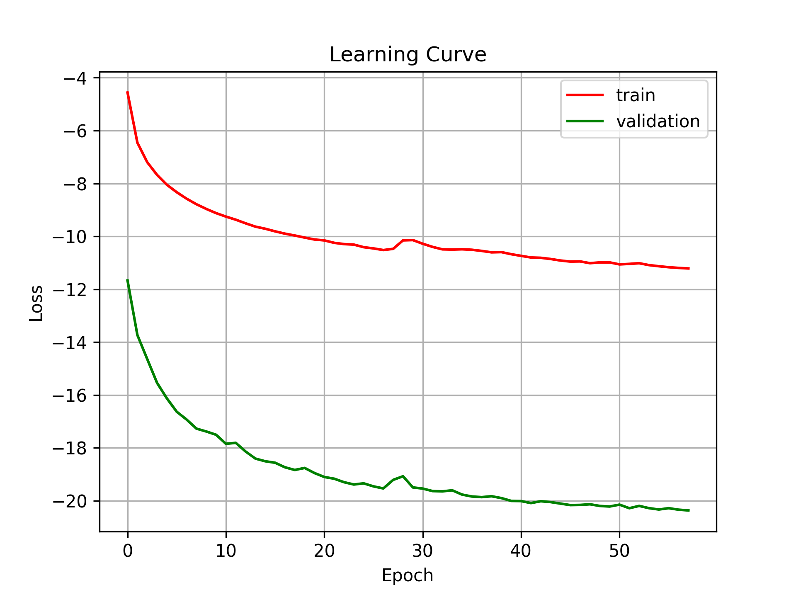
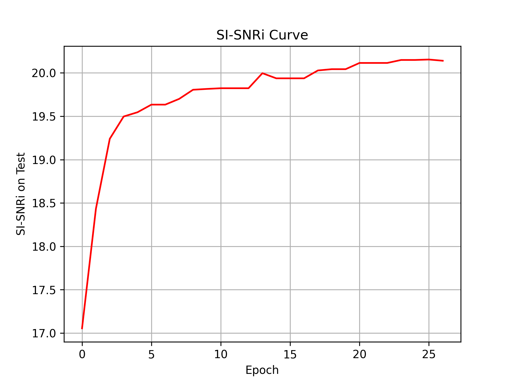

# SVoice: Speaker Voice Separation using Neural Nets

We provide a [PyTorch][pytorch] implementation of our speaker voice separation research work. In [Voice Separation with an Unknown Number of Multiple Speakers][icml], we present a new method for separating a mixed audio sequence, in which multiple voices speak simultaneously. The new method employs gated neural networks that are trained to separate the voices at multiple processing steps, while maintaining the speaker in each output channel fixed. A different model is trained for every number of possible speakers, and the model with the largest number of speakers is employed to select the actual number of speakers in a given sample. Our method greatly outperforms the current state of the art, which, as we show, is not competitive for more than two speakers. Please note that this implementation does not contain the "IDloss" as described in the paper.

Audio samples can be found here: [Samples][web]

<p align="center">
</p>

## Installation

First, install Python 3.7 (recommended with Anaconda).

Clone this repository and install the dependencies. We recommend using
a fresh virtualenv or Conda environment.

```bash
git clone git@github.com:fairinternal/svoice.git
cd svoice
pip install torch==1.6.0+cu101 torchvision==0.7.0+cu101 -f https://download.pytorch.org/whl/torch_stable.html
pip install -r requirements.txt  
```

## Setup

### Configuration

We use [Hydra][hydra] to control all the training configurations. If you are not familiar with Hydra
we recommend visiting the Hydra [website][hydra-web].
Generally, Hydra is an open-source framework that simplifies the development of research applications
by providing the ability to create a hierarchical configuration dynamically.

The config file with all relevant arguments for training our model can be found under the `conf` folder.
Notice, under the `conf` folder, the `dset` folder contains the configuration files for
the different datasets. You should see a file named `config.yaml` with the relevant configuration for the debug sample set.

You can pass options through the
command line, for instance `python train.py lr=1e-4`.
Please refer to [conf/config.yaml](conf/config.yaml) for a reference of the possible options.
You can also directly edit the `config.yaml` file, although this is not recommended
due to the way experiments are automatically named, as explained hereafter.

### Checkpointing

Each experiment will get a unique name based on the command line options you passed.
Restarting the same command will reuse the existing folder and automatically
start from a previous checkpoint if possible. In order to ignore previous checkpoints,
you must pass the `restart=1` option.
Note that options like `device`, `num_workers`, etc. have no influence on the experiment name.

### Setting up a new dataset

If you want to train using a new dataset, you can:
1. Create a separate config file for it.
2. Place the new config files under the `dset` folder. Check [conf/dset/debug.yaml](conf/dset/debug.yaml)
for more details on configuring your dataset.
3. Point to it either in the general config file or via the command line, e.g. `./train.py dset=name_of_dset`.

You also need to generate the relevant `.json`files in the `egs/`folder.
For that purpose you can use the `python -m svoice.data.audio` command that will
scan the given folders and output the required metadata as json.
For instance, if your mixture files are located in `$mix` and the separated files are in `$spk1` and `$spk2`, you can do

```bash
out=egs/mydataset/tr
mkdir -p $out
python -m svoice.data.audio $mix > $out/mix.json
python -m svoice.data.audio $spk1 > $out/s1.json
python -m svoice.data.audio $spk1 > $out/s1.json
```

### Creating your own dataset

We provide a dataset generation script in which users can create their own noisy and reverberant datasets. This dataset generation scripts follows the same recipes as described in our recent ICASSP-2021 paper: [Single Channel Voice Separation for Unknown Number of Speakers Under Reverberant and Noisy Settings][icassp]. Generation scripts can be found under: `scripts/make_dataset.py`. This data generation scripts gets as input the clean recordings, together with a set of noises and uses these recordings to generate a noisy-reverberant dataset. We synthesize room impulse responses using the following [RIR-Generator][nprirgen] package, which uses the image method, proposed by [Allen and Berkley in 1979][rir]. This method is one of the most frequently used methods in the acoustic signal processing community to create synthetic room impulse responses. 

In case of generating a reverberant data, one needs to first install the [RIR-Generator][nprirgen] package. 

For more details regarding possible arguments, please see:

```
usage: Mode [-h] [--in_path IN_PATH] [--out_path OUT_PATH]
            [--noise_path NOISE_PATH] [--num_of_speakers NUM_OF_SPEAKERS]
            [--num_of_scenes NUM_OF_SCENES] [--sec SEC] [--sr SR]

optional arguments:
  -h, --help            show this help message and exit
  --in_path IN_PATH
  --out_path OUT_PATH
  --noise_path NOISE_PATH
  --num_of_speakers NUM_OF_SPEAKERS
                        no of speakers.
  --num_of_scenes NUM_OF_SCENES
                        no of examples.
  --sec SEC
  --sr SR
```

## Usage
### Quick Start with Toy Example
1. Run `./make_debug.sh` to generate json files for the toy dataset.
2. Run `python train.py`

Notice, we already provided the yaml file for it. Can be found under `conf/dset/debug.yaml`.

### Data Structure
The data loader reads both mixture and separated json files named: `mix.json` and `s<id>.json` where `<id>` is a running identifier. These files should contain all the paths to the wav files to be used to optimize and test the model along with their size (in frames).
You can use `python -m svoice.data.audio FOLDER_WITH_WAV1 [FOLDER_WITH_WAV2 ...] > OUTPUT.json` to generate those files.
You should generate the above files for both training and test sets (and validation set if provided). Once this is done, you should create a yaml (similarly to `conf/dset/debug.yaml`) with the dataset folders' updated paths.
Please check [conf/dset/debug.yaml](conf/dset/debug.yaml) for more details.

#### WSJ Mixture Generation 
In case you have access to the origin wsj0 data (sphere format), you can generate the mixtures using the tools provided in the following [repository][convtas] (see usage section in the readme). 
You can access the csv files containing all the metadata for generating the mixtures from the following [samples page][web].


### Training
Training is simply done by launching the `train.py` script:

```
python train.py
```

This will automaticlly read all the configurations from the `conf/config.yaml` file. You can override different configuration arguments from the command, this will automaticlly generate new folder using the override params.
```
python train.py lr=0.001
python train.py dset=librimix lr=0.001 swave.R=8
```

#### Distributed Training

To launch distributed training you should turn on the distributed training flag. This can be done as follows:

```
python train.py ddp=1
```

#### Logs

Logs are stored by default in the `outputs` folder. Look for the matching experiment name.
In the experiment folder you will find the training checkpoint `checkpoint.th` (containing the last state as well as the best state)
as well as the log with the metrics `trainer.log`. All metrics are also extracted to the `history.json`
file for easier parsing. Enhancements samples are stored in the `samples` folder (if `mix_dir` or `mix_json`
is set in the dataset config yaml file).

### Evaluating

Evaluating the models can be done by launching the following:

```
python -m svoice.evaluate <path to the model> <path to folder containing mix.json and all target separated channels json files s<ID>.json>
```

For more details regarding possible arguments, please see:

```
usage: Evaluate separation performance using MulCat blocks [-h]
                                                           [--device DEVICE]
                                                           [--sdr SDR]
                                                           [--sample_rate SAMPLE_RATE]
                                                           [--num_workers NUM_WORKERS]
                                                           [-v]
                                                           model_path data_dir

positional arguments:
  model_path            Path to model file created by training
  data_dir              directory including mix.json, s1.json, s2.json, ...
                        files

optional arguments:
  -h, --help            show this help message and exit
  --device DEVICE
  --sdr SDR
  --sample_rate SAMPLE_RATE
                        Sample rate
  --num_workers NUM_WORKERS
  -v, --verbose         More loggging
```

### Separation

Separating files can be done by launching the following:

```
python -m svoice.separate <path to the model> <path to store the separated files> --mix_dir=<path to the dir with the mixture files>
```

Notice, you can either provide `mix_dir` or `mix_json` for the test data.
For more details regarding possible arguments, please see:

```
usage: Speech separation using MulCat blocks [-h] [--mix_dir MIX_DIR]
                                             [--mix_json MIX_JSON]
                                             [--device DEVICE]
                                             [--sample_rate SAMPLE_RATE]
                                             [--batch_size BATCH_SIZE] [-v]
                                             model_path out_dir

positional arguments:
  model_path            Model name
  out_dir               Directory putting enhanced wav files

optional arguments:
  -h, --help            show this help message and exit
  --mix_dir MIX_DIR     Directory including mix wav files
  --mix_json MIX_JSON   Json file including mix wav files
  --device DEVICE
  --sample_rate SAMPLE_RATE
                        Sample rate
  --batch_size BATCH_SIZE
                        Batch size
  -v, --verbose         More loggging
```


## Results 
Using the default configuration (same one as presented in our [paper][arxiv]), results should be similar to the following. 
All reprted numbers are the Scale-Invariant Signal-to-Noise-Ratio improvment (SI-SNRi) over the input mixture.

| Model       | #params | 2spk  | 3spk  | 4spk  | 5spk  |
|-------------|---------|-------| ------| ------| ------|
| ADANet      | 9.1M    | 10.5  | 9.1   |   -   |   -   |
| DPCL++         | 13.6M   | 10.8  | 7.1   |   -   |   -   |
| CBLDNN-GAT     | 39.5M   | 11.0  |   -   |   -   |   -   |
| TasNet         | 32.0M   | 11.2  |   -   |   -   |   -   |
| IBM            | -       | 13.0  | 12.8  | 10.6  | 10.3  |
| IRM            | -       | 12.7  | 12.5  |  9.8  |  9.6  |
| ConvTasNet     | 5.1M    | 15.3  | 12.7  |  8.5  |  6.8  |
| FurcaNeXt      | 51.4M   | 18.4  |   -   |   -   |   -   |
| DPRNN          | 3.6M    | 18.8  | 14.7  | 10.4  |  8.7  |
| <b>Ours        | <b> 7.5M    | <b>20.1  | <b>16.9  | <b>12.9  | <b>10.6  |


#### Learning Curves 
The following learning cures were obtained using L=8 (the encoder kernel size): 

<p align="center">


</p>


## Citation
If you find our code or models useful for your research, please cite it as:

```
@inproceedings{nachmani2020voice,
  title={Voice Separation with an Unknown Number of Multiple Speakers},
  author={Nachmani, Eliya and Adi, Yossi and Wolf, Lior},
  booktitle={Proceedings of the 37th international conference on Machine learning},
  year={2020}
}
```

If you find our dataset generation pipeline useful, please cite it as:

```
@inproceedings{chazan2021single,
  title={Single channel voice separation for unknown number of speakers under reverberant and noisy settings},
  author={Chazan, Shlomo E and Wolf, Lior and Nachmani, Eliya and Adi, Yossi},
  booktitle={ICASSP 2021-2021 IEEE International Conference on Acoustics, Speech and Signal Processing (ICASSP)},
  pages={3730--3734},
  year={2021},
  organization={IEEE}
}
```

## License
This repository is released under the CC-BY-NC-SA 4.0. license as found in the [LICENSE](LICENSE) file.

The file: `svoice/models/sisnr_loss.py` and `svoice/data/preprocess.py` were adapted from the [kaituoxu/Conv-TasNet][convtas] repository. It is an unofficial implementation of the [Conv-TasNet: Surpassing Ideal Time-Frequency Magnitude Masking for Speech Separation][convtas-paper] paper, released under the MIT License.
Additionally, several input manipulation functions were borrowed and modified from the [yluo42/TAC][tac] repository, released under the CC BY-NC-SA 3.0 License.

[icml]: https://arxiv.org/abs/2003.01531.pdf
[icassp]: https://arxiv.org/pdf/2011.02329.pdf
[web]: https://enk100.github.io/speaker_separation/
[pytorch]: https://pytorch.org/
[hydra]: https://github.com/facebookresearch/hydra
[hydra-web]: https://hydra.cc/
[convtas]: https://github.com/kaituoxu/Conv-TasNet 
[convtas-paper]: https://arxiv.org/pdf/1809.07454.pdf
[tac]: https://github.com/yluo42/TAC
[nprirgen]: https://github.com/ty274/rir-generator
[rir]:https://asa.scitation.org/doi/10.1121/1.382599
